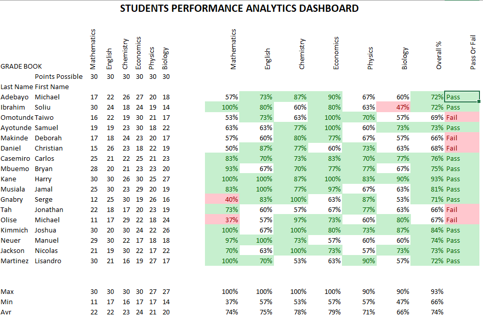
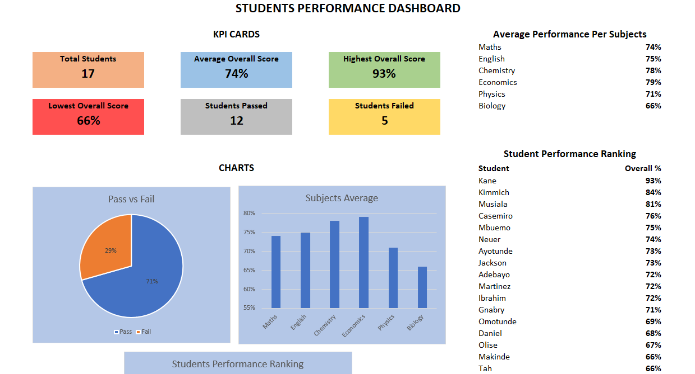
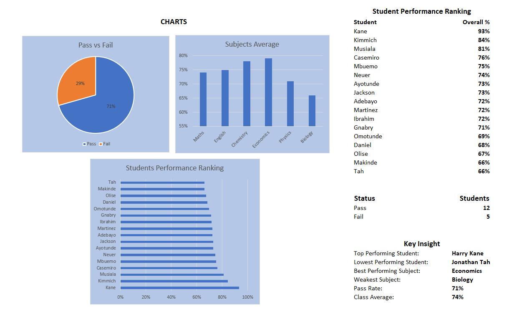

# 📊 Student Performance Analytics Dashboard (Microsoft Excel)

## Overview

The Student Performance Analytics Dashboard is an Excel-based project developed to analyze and visualize students' academic performance across multiple subjects.

The dashboard transforms raw grade data into meaningful insights using KPIs, charts, conditional formatting, and performance rankings, allowing educators and stakeholders to quickly evaluate student outcomes.

---

## Features

- 📌 Student Grade Book
- 📈 Interactive Performance Dashboard
- 📊 Subject Performance Analysis
- 📉 Student Performance Ranking
- 📋 Key Performance Indicators (KPIs)
- ✅ Pass vs Fail Analysis
- 🎨 Conditional Formatting (Heat Map)
- 📐 Automatic Performance Calculations

---

## Dashboard KPIs

The dashboard displays:

- Total Students
- Average Overall Score
- Highest Overall Score
- Lowest Overall Score
- Students Passed
- Students Failed

---

## Visualizations

The dashboard includes:

- Pass vs Fail Pie Chart
- Average Score by Subject
- Student Performance Ranking
- Student Average Score Comparison

---

## Skills Demonstrated

This project demonstrates proficiency in:

- Microsoft Excel
- Data Cleaning
- Data Analysis
- Dashboard Design
- Data Visualization
- Conditional Formatting
- Statistical Summary
- Formula Development
- Performance Reporting

---

## Excel Features Used

- IF()
- AVERAGE()
- MAX()
- MIN()
- COUNTIF()
- Charts
- Conditional Formatting
- Cell Formatting
- Dashboard Design

---

## Dataset

The dataset contains academic records for 17 students across six subjects:

- Mathematics
- English
- Chemistry
- Economics
- Physics
- Biology

The data used is fictional and created for learning and portfolio purposes.

---

## Project Objective

The objective of this project is to demonstrate how Microsoft Excel can be used to build an effective academic performance dashboard for analyzing student results and supporting data-driven decision making.

---

## Project Preview

### Grade Book

### Dashboard

---

## Author

**Okechukwu Charles**

Industrial Mathematics Graduate | Aspiring Data Analyst

GitHub: https://github.com/Okechukwu4Charles 
